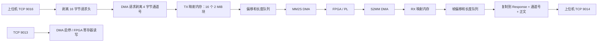

# 当前代码数据流与函数调用

分析依据：2026-09-28 当前工作区源码和默认编译开关，包含工作区已有修改。

## 1. 总体路径



TX/RX 是独立内存区域。DMA 只有通道 0（`SGDMA_NUM=1`）；AXI FIFO 启用通道 0、1（`FIFO_NUM=2`）。1553B、TX 造数、RX 造数默认均关闭。

## 2. 启动与资源初始化

入口 `src/main.cpp::main` 按以下顺序执行：

```text
main
├─ 注册信号处理 prog_exit
├─ recv_dma_init
│  ├─ sgdna_rx_init(0)
│  │  ├─ data_stream_init → ringbuffer_create
│  │  └─ sgdma_init → DMA_BUFFER_RX
│  └─ pthread_create → zmuav_pl2ps_irq_recv_pthread
├─ system_init
│  ├─ pthread_mutex_init
│  ├─ sgdna_tx_init(0)
│  │  ├─ data_stream_init → ringbuffer_create
│  │  └─ sgdma_init → DMA_BUFFER_TX
│  └─ pthread_create → sgdma_network_queue_pthread
├─ axififo_data_init
│  ├─ pcie_bar_open / pcie_bar_mmap / stream_fifo_reset
│  ├─ malloc / ringbuffer_create：FIFO RX、TX 缓冲
│  └─ pthread_create → FIFO 收、发两个线程
├─ SyncSend::GetInstance → Init → TCP 9014 / DaemodLoop
├─ NetServer::Init(9013) → ServiceLoop
├─ NetServer::Init(9016) → DataServiceLoop
└─ sleep 循环
```

`sgdma_init` 在 `src/hardware/dma_utils.c`：

1. `/dev/mem` + `mmap64` 映射 DMA 寄存器。TX 基址 `0xa2001000`，RX 基址 `0xa2000000`。
2. 打开中断设备：TX `/dev/zmuav_pl2ps_irq_1`，RX `/dev/zmuav_pl2ps_irq_0`。
3. `dma_buffer_map` 打开 `/dev/zmuav_wrmem`，通过 `AXIS_FIFO_SET_MALLOC_SIZE` 申请内存，再查询容量和物理地址，检查地址范围与区域重叠。
4. 当前实际调用 `mmap(..., owner, base)`，直接使用 wrmem 文件描述符映射数据内存。源码中的 `/dev/mem` 数据映射代码已注释，但日志、头文件注释和 README 仍有旧描述。

TX/RX 各申请 `(16+1) × 2 MiB = 34 MiB`；9016 只使用 TX 的前 32 MiB。物理地址由驱动返回，提交 DMA 时使用物理基址加偏移。

## 3. 下行：TCP 9016 → DMA → PL

实现：`src/network/network_main.cpp`、`src/system/system.cpp`。

```text
NetServer::DataServiceLoop
├─ network_rx_dma_buffer：取得 TX 内存基址
├─ TcpSocket::Accept → poll
├─ TcpSocket::Recv：累计接收 16 字节 Request 头
│  └─ ntohl(header.length)：取得正文长度
├─ DMA 请求（index=0x0204）：累计接收并丢弃 4 字节通道号
├─ network_dma_reserve：预留空闲块的可写区域
├─ TcpSocket::Recv(destination, length) → recv
│  └─ 正文直接进入 DMA 映射内存
└─ network_dma_received：累计到 2 MiB 后入队 {offset, length}

sgdma_network_queue_pthread
├─ network_dma_dequeue：取一个描述符，标记 IN_FLIGHT
├─ __sync_synchronize：内存顺序屏障
├─ mm2s_dma_enable
├─ push_mm2s_dma：写源物理地址和长度寄存器
├─ SelectBlock → select：等待 DMA 中断设备就绪
├─ mm2s_dma_disable：实际向状态寄存器写 0x7000 清状态
└─ network_dma_release：完成后释放块
```

块状态：`FREE → FILLING → QUEUED → IN_FLIGHT → FREE`。同一时刻只提交一个 DMA 块；超时后保留该块，继续等待完成，不提前复用。

每次接收长度为“当前请求正文剩余长度”和“当前块剩余空间”的较小值，允许 TCP 拆包、粘包和跨请求拼成一个 DMA 块。DMA 请求（index=0x0204）剥离正文前 4 字节通道号，length 小于 4 时关闭连接；通道号不参与路由，仍写入现有 DMA 通道 0 的映射。64 KiB 有效数据对应 length=65540，报文总长 65556 字节，32 个请求累计成 2 MiB 后提交。其他 index 保留原有正文直写行为，不调用旧分发表，也不校验 cmd_code。

没有额外的应用层正文 memcpy，但 `recv` 仍涉及内核向用户缓冲区复制。队列占满或 DMA 暂停时，停止读取正文，让 TCP 产生背压。未满 2 MiB 的块继续等待；断连调用 `network_dma_abort_partial` 丢弃未满块，已入队的完整块保留。

`[NET 9016 RX]` 统计去头正文接收速率；`[DMA TX]` 统计完成速率，两者对应不同阶段。

## 4. 上行：PL → DMA → TCP 9014

```text
zmuav_pl2ps_irq_recv_pthread
├─ ringbuffer_is_full：队列满则等待
├─ s2mm_dma_enable
├─ get_s2mm_dma：写目的物理地址和 2 MiB 接收长度
├─ SelectBlock：等待完成；超时补查 S2MM 状态 IOC 位
├─ getdatacount：读取接收长度寄存器
├─ pcie_data_to_queue → ringbuffer_put：入队 {frame_offset, frame_size}
└─ 前移内存偏移 / s2mm_dma_disable 清状态

SyncSend::DaemodLoop
├─ TcpSocket::Accept：等待 9014 客户端
├─ rx_sgdma_data_get → ringbuffer_get：取帧信息和映射内存指针
├─ 填 Response 头 + 4 字节网络序 DMA 通道号
├─ memcpy：将 DMA 数据复制到复用的连续发包缓冲区
└─ TcpSocket::SendFully → Send → send：完整发送
```

9014 当前只消费 DMA RX 队列，不消费 AXI FIFO RX 队列。没有客户端时 DMA RX 队列可填满，随后接收线程等待腾出空间。

## 5. 控制、事件、FIFO 和可选分支

| 模块 | 调用路径 | 当前状态 |
| --- | --- | --- |
| 9013 控制接收 | `ServiceLoop → RecvFully → ProcMessage → mapEntry_` | 启用 |
| 0x0201 DMA 启停 | `NetDmaMM2SControl → sgdma_mm2s_start`，或 `sgdma_mm2s_stop → is_sgdma_mm2s_stop` | flag 0xaa 启动，0xbb 暂停并等待在途传输结束；暂停不清除完整块队列 |
| 0xff00 / 0xff01 | `WriteFpgaRegister / ReadFpgaRegister → open / mmap / 寄存器访问` | 启用 |
| 控制回复 | `SendResponse → TcpSocket::SendFully` | 回复到控制连接 |
| 9015 事件 | 控制连接建立后 `Exception::Init → Thread::Run → SendException`；事件入口 `SendEvent → Exception::Send` | 主动连接上位机 9015，非本地监听端口 |
| FIFO RX | `axififo_recv_data_pthread → fifo_memcpy_rb_avail → stream_fifo_read_data_len → stream_fifo_read_data → fifo_memcpy_data → pcie_data_to_queue` | 两路轮询并缓存；`rx_fifo_data_get` 当前无调用者，没有继续上传 |
| FIFO TX | `fifo_tx_memcpy_data` 入队；`axififo_send_data_pthread → axififo_get_send_size → ringbuffer_get → axififo_pure_data_send → stream_fifo_write_data` | 线程已启动；旧网络生产入口没有接入当前 9016 |
| 旧数据分发 | `DataProcMessage → DatamapEntry_ → FIFOSendData / NetDmaMM2S` | 当前无调用者；`NetDmaMM2S` 仅返回 0；`FIFOSendData` 可按最多 508 字节分段入 FIFO TX 队列 |
| 1553B / 9017 | `init_1553B → dma_buffer_map`；`Send1553BData → write_1553B`、`Read1553BData → read_1553B`、`DDR_Phy_Get → get_1553B_phy` | `ENABLE_1553B=0`，入口关闭 |
| TX/RX 造数 | `sgdma_synthetic_tx_pthread / synthetic_dma_rx_pthread` | 默认关闭，仅对应开关开启后替换工作线程 |
| 旧 DMA TX | `sgdma_h_tx_pthread / sgdma_l_tx_pthread` | `#if 0` 排除 |
| 容量上报 | `NetServer::DaemodLoop → sgdma_mm2s_query_capacity / sgdma_vfifo_query_capacity / axififo_query_capacity` | `#if 0` 排除 |

底层支撑：`ringbuffer.c` 保存帧描述符；`stream_fifo.c` 访问 FIFO 寄存器和数据窗口；`pcie_reg_rw.c` 提供物理地址映射及寄存器读写；`tcp_socket.cpp` 封装 socket；`thread.*` 封装 pthread；`cmd_packet.h` 定义网络请求、应答。`queue.c` 和 `xutils.c` 是队列、时间、校验等辅助实现，不是 9016 的 DMA 块所有权管理器。

退出路径是 `prog_exit → system_exit / recv_dma_exit → sgdma_exit → dma_buffer_unmap → munmap → release_owner → FREE_MALLOC_PHY ioctl / close`。当前退出没有先 join 工作线程，也没有调用 `axififo_data_destory`；这是现有资源收尾问题。SIGKILL 无法被信号处理函数捕获。

## 6. dma_buffer_sync_for_device 核查

当前源码、头文件、测试中没有 `dma_buffer_sync_for_device` 的声明、实现或调用，已经满足移除该函数的目标，本次无需再修改运行代码。

发送路径已是：

```cpp
__sync_synchronize();
mm2s_dma_enable(dma);
push_mm2s_dma(dma, descriptor.offset, descriptor.length);
```

`zmuav_wrmem.h` 保留 `AXIS_FIFO_SYNC_FOR_DEVICE` 驱动接口常量，但没有调用。常量定义不会执行缓存同步 ioctl。`__sync_synchronize` 是内存顺序屏障，不等同于缓存清理；当前映射是否提供 DMA 所需的一致性，要看 wrmem 驱动的分配与 mmap 实现，本仓库不含该驱动实现，不能仅凭用户态代码确认。

## 7. 验证与已知限制

本次仅新增分析文档，保留工作区原有代码修改。验证当前源码结果：

- ARM 交叉编译成功：`cmake -S . -B /tmp/zmht-dataflow-build && cmake --build /tmp/zmht-dataflow-build -j4`。
- `bash tests/run_network_dma_queue_test.sh` 通过：块队列顺序、部分块、背压、环回、启停、超时期间所有权。
- `bash tests/run_network_queued_test.sh` 通过：TCP 拆包/粘包、去头、DMA 通道号剥离、64 KiB 负载、非法长度、重连、映射写入和边界。
- `bash tests/run_local_dma_test.sh` 通过：可选 TX 造数双缓冲逻辑。
- `bash tests/run_devmem_test.sh` 失败：测试只替换 `mmap64` 且要求 `/dev/mem` 描述符；当前数据映射已改为 wrmem 描述符上的 `mmap`，未被测试拦截，首次 `dma_buffer_map` 失败。这是现有源码与旧测试不一致，不能据此判定板上 wrmem 映射成败。
- 现有编译警告包括 `SelectBlock2` 的 select 超时参数类型错误、ARM 上 32 位变量左移 32 位，以及本机测试报告的 `dma_disable` 缺少返回值。
- 尚未上板验证缓存一致性、硬件数据完整性、DMA 完成通知和实际吞吐。
