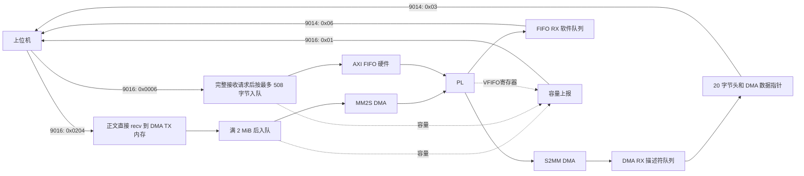

# 当前收发数据流

## 1. 端口与线程

| 端口 | 工作线程 | 用途 |
| --- | --- | --- |
| 9016 | `NetServer::DataServiceLoop` | 接收 DMA/FIFO 请求并分流 |
| 9016 同一连接的反向数据 | `NetServer::DaemodLoop` | 周期上报下行缓冲区容量 |
| 9014 | `SyncSend::DaemodLoop` | 上传 DMA 和16 路 AXI FIFO 数据 |
| 9013 | `NetServer::ServiceLoop` | DMA 启停和 FPGA 寄存器访问 |
| 9015 | `Exception::SendException` | 板卡主动连接上位机的事件服务 |

DMA TX、DMA RX、FIFO TX、FIFO RX 各有独立工作线程。默认关闭 1553B/9017 与 DMA 造数。`FIFO_NUM=16`，AXI FIFO 初始化、访问通道 0～15。



## 2. 9016 下发

请求头为 16 字节，`length` 为正文长度。支持的 `index` 为 `0x0204`（DMA）和 `0x0006`（FIFO）。两者正文都以 4 字节大端通道号开头，长度小于 4、负长度编码或未知 index 会关闭连接。当前 DMA 通道号仍只剥离、不用于路由，实际使用 DMA 0；FIFO 通道必须为 0～15。

### DMA：保持原有块队列

```text
接收并剥离请求头/通道号
 → network_dma_reserve 取得可写指针
 → recv(..., MSG_DONTWAIT) 直接写 DMA 映射内存
 → network_dma_received
 → 满 2 MiB 后入队
 → sgdma_network_queue_pthread
 → MM2S 完成后释放块
```

单次 recv 长度不超过请求剩余正文、当前块剩余空间和 256 KiB。16 个 2 MiB 块使用 TX 映射的前 32 MiB；状态为 `FREE → FILLING → QUEUED → IN_FLIGHT → FREE`。请求可以跨块，多个请求可以拼成同一块，插入 FIFO 请求不改变未满 DMA 块的填充位置。

同一时刻仅提交一笔 MM2S。超时后保留在途块继续等。队列满或暂停时停止读取正文。未满块不会自动提交，断连时丢弃；完整排队块保留。DMA 提交前的屏障、物理地址、长度和完成释放逻辑未改变。

### FIFO：沿用软件队列与硬件发送路径

```text
剥离请求头和 FIFO 通道号
 → 按当前请求长度分配缓冲区，收齐全部数据
 → 按最多 508 字节拆块，依次 fifo_tx_try_memcpy_data
 → 原 FIFO TX 队列
 → axififo_send_data_pthread
 → axififo_pure_data_send → stream_fifo_write_data
```

完整请求收到前不发布任何片段；TCP 短读不会改变 508 字节分块边界。队列满时保留当前片段并等待，检测断连后退出等待。已入队片段保留，未入队暂存数据在断连时丢弃。每路 16384 个槽，每槽占 512 字节、有效正文最多 508 字节；原 `fifo_tx_memcpy_data` 保留为阻塞包装。

DMA 和 FIFO 共用有序 TCP 字节流，当前请求因队列满而等待时，后面的其他类型请求也会等待。

## 3. 9014 上传

DMA 接收仍是每次提交 2 MiB S2MM 接收容量，完成后将实际长度和偏移入队；17 个内存槽对应 16 个队列槽。上传通过 `SendVectorFully` 发送 20 字节头部和 DMA 内存指针，完整发送后才取下一帧。最大 2 MiB 的 DMA 数据仍作为一个应用报文，不进行 512 KiB 分片，也不复制到 malloc 组包缓冲区。

FIFO 上传恢复历史 `ClassResponse` 协议：`UP_CODE=0x01CCF0FF`、`index=0x06`、正文为 4 字节大端通道号和数据。每轮以轮询方式最多发送 64 个 FIFO 报文，然后取一个完整 DMA 帧；16 个 FIFO 通道轮询消费。

FIFO 硬件接收读取本轮 RDFO 快照，按其长度分配暂存区并全部读出，再按最多 508 字节拆入 RX 队列。队列满时等待 9014 消费后继续入队；不再因超过 508 字节拒绝整批数据，也不使用固定 1024 字节数组承载整个 RDFO。暂存分配失败时保留硬件数据，下一轮重试。FIFO RX 队列和地址递增方式沿用原实现。

FIFO 报文仅在完整 DMA 报文之间插入，不能抢占正在阻塞的 DMA 发送。发送超时或失败关闭连接；当前已出队失败帧不会自动重发。无客户端时不消费上传队列。

`[NET 9014 TX]` 仍统计 DMA 报文，FIFO 字节不计入该 DMA 速率；`[NET 9016 RX]` 仍统计 DMA 正文进入映射内存的速率。

## 4. 9016 容量上报

独立线程在连接存在时采集容量并发送，随后休眠 20 ms。与下发共用同一 TCP socket；连接指针由锁保护，接收线程销毁 socket 前先 shutdown 唤醒阻塞发送，再取得锁。发送失败由报告线程 shutdown，最终由接收线程关闭和释放连接。

报文沿用 `RES_CODE=0x05CCF0FF`、`index=0x0001`。16 字节头加 400 字节正文，总计 416 字节。每项为 1 字节通道号加 6 个大端 uint32，共 25 字节，固定发送 16 项。

| 字段 | 来源与单位 |
| --- | --- |
| dmaddr_space | DMA 空闲块加正在填充块的剩余字节，除以 1024；暂停时为 0。16 项重复同一共享 DMA 容量，不能累加 |
| vfifo_space | 保留 16 路 PL VFIFO 查询，按 `64 MiB - 寄存器值 × 4` 计算字节数 |
| axififo_space | 通道 0～15 各自的 FIFO TX 剩余槽位数乘 512 |
| can_space / pulse_space / simulation_space | 当前为 0 |

容量是剩余空间快照，不是 DMA 完成确认。FIFO 的槽位存储字节不等同于任意短帧的可接收净负载。VFIFO 和 AXI FIFO 是不同的资源，分别保留 16 项。

上位机应持续读取反向容量报文；报告发送发生超时会关闭该连接，避免部分上报报文后继续拼接新帧。

## 5. 验证与边界

- `run_network_mixed_test.sh`：真实 TCP 混合下发、16 路 FIFO、整包接收后发布、2501 字节 RDFO 全量读取、508 字节边界、满队列、容量字节序与单位、混合上传、非法通道与重连。模拟硬件消费者和 VFIFO 寄存器。
- `run_network_queued_test.sh`：原 DMA 直写、TCP 拆包粘包、64 KiB 请求、环回和断连尾块回归。
- `run_network_dma_queue_test.sh`：原 DMA 块所有权、背压、启停与超时回归。
- `run_network_rx_vector_test.sh`：DMA 指针发送、短写、EINTR、超时与缓冲区保护。

TX/RX 内存由 wrmem 驱动分配并映射；缓存属性与硬件一致性取决于驱动实现。本机测试不能代替板上验证。当前仍有历史编译警告和退出时未先 join 硬件线程等既有问题。

16 路 FIFO 的 TX/RX 数据区合计约 256 MiB，另有描述符队列、完整下发请求暂存和 RDFO 暂存；板卡需有足够可用内存，位流需映射全部 16 路 FIFO。
